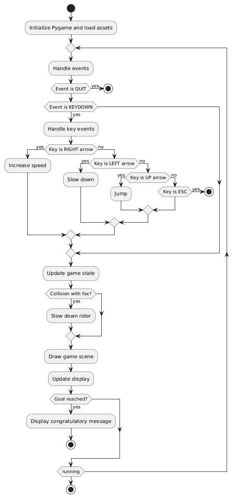

# Lesson 1: Start Game Development with PyGame

## Introduction

Welcome to the Horse Racing Game tutorial series! This tutorial will teach you how to create a simple horse racing game using Pygame. Pygame is a set of Python modules designed for writing video games.

### Game Description

In this game, you control a horse rider racing across a track. You can make the rider run, slow down, and jump to avoid obstacles like foxes. The goal is to reach the finish line as quickly as possible.

### How to Play

- **RIGHT Arrow Key:** Increase speed and run faster.
- **LEFT Arrow Key:** Slow down.
- **UP Arrow Key:** Jump to avoid coming foxes which slow you down.
- **ESC Key:** Quit the game.

Avoid hitting foxes, as they will slow you down.

### Technical Design

1. **Pygame Initialization:** Set up Pygame and the game window.
2. **Display Setup:** Configure the display window and load images.
3. **Animation:** Use spritesheets for rider and fox animations.
4. **Collision Detection:** Check for collisions between the rider and foxes.
5. **Game Loop:** Main loop to handle events, update game state, and redraw the screen.

### Logic Flow



## Tutorial Structure

This tutorial is divided into 7 sessions. We can build it piece by piece, step by step.

1. **Lesson 1:** Start a program with background image only.
2. **Lesson 2:** Scroll the background to move.
3. **Lesson 3:** Add a rider image.
4. **Lesson 4:** Add animations, slowing down and jumping up.
5. **Lesson 5:** Add a fox and its animation.
6. **Lesson 6:** Add collision detection; fox can make the rider slow.
7. **Lesson 7:** Show text components and complete the game.

By the end of these sessions, you will have a fully functional horse racing game and a solid understanding of Pygame's fundamentals.

Let's get started with **Lesson 1**!

## Introduction to Pygame

### What is Pygame?

[Pygame](https://www.pygame.org/) is a set of Python modules designed for writing video games. It supports the creation of games and multimedia programs in Python.

### Why Use Pygame?

- **Ease of Use:** Simple and straightforward API, great for beginners.
- **Python Integration:** Leverages Python’s readability and efficiency.
- **Community Support:** Large community with plenty of resources and tutorials.
- **Ideal for Learning:** Perfect for teaching programming and game development.

## Requirements
- Python 3.12
- [Pygame](https://www.pygame.org/)

## Preparation
1. Install Python 3.12 if you haven't already.
2. Create your project folder, e.g. `py_horse_racing` and change directory to there
3. Create a Virtual Environment by running `python3 -m venv .venv`
4. Activate the Virtual Environment by running `source .venv/bin/activate`
5. Install Pygame by running `pip install pygame`.

## Lesson 1 Code

In this lesson, we'll start a Pygame program that displays a background image. Open the code [lesson_1.py](lesson_1.py)

### Import Pygame

First, import the necessary Pygame modules. Add this code at the top of your script:


```python
import pygame
from pygame.locals import *
```

### Define Constants
Define some constants for the screen dimensions, colors, and file paths:

```python
# Constants
SCREEN_WIDTH = 640
SCREEN_HEIGHT = 480
BLACK = Color('black')
FOLDER_PREFIX = 'images/'
BACKGROUND_PATH = FOLDER_PREFIX + 'bg_environment.png'
GAME_TITLE = 'Horse Racing - Step 1'
```

### Initialize Pygame
Initialize the Pygame engine and set up the display:

```python
# initializes the pygame engine	
print('The game ' + GAME_TITLE + ' is starting...')
pygame.init()

# Set up the display
DISPLAYSURF = pygame.display.set_mode((SCREEN_WIDTH, SCREEN_HEIGHT))
pygame.display.set_caption(GAME_TITLE)
```

### Load the Background Image
Load the background image that you placed in the images folder:

```python
# Load the background image
background_image = pygame.image.load(BACKGROUND_PATH)
```

### Create the Main Loop
Create the main loop that will keep the game running and handle events:

```python
# Main loop
running = True
while running:
    for event in pygame.event.get():
        if event.type == QUIT:
            running = False
    
    # Draw the background
    DISPLAYSURF.fill(BLACK)
    DISPLAYSURF.blit(background_image, (0, 0))

    # Update the display
    pygame.display.update()

pygame.quit()
print('The game ' + GAME_TITLE + ' has ended')

```

### Run the Script
Save your script and run it.

```bash
python lesson_1.py
```

## Summary 
In this code:
- We initialize Pygame and set up the display.
- We load and display a background image.
- We create a game loop that keeps running until the window is closed.

[Continue to Lesson 2](LESSON_2.md)