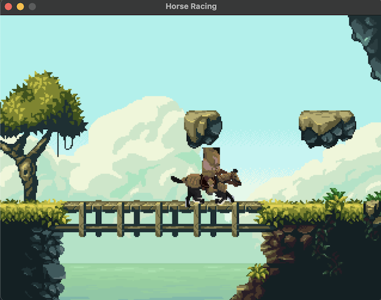

# Horse Racing Game

## Introduction
Welcome to Horse Racing, a simple Pygame-based game where you control a horse rider through a scrolling environment. In this game, you'll experience the thrill of horse racing as you navigate your way through the track.

## Gameplay
- Use the RIGHT arrow key to speed up the horse rider.
- Use the LEFT arrow key to slow down the horse rider.
- Press the ESC key to exit the game.

## Programming Logic
- **Initialization**: The game initializes Pygame and sets up the display window with a specified width and height.
- **Sprites and Animations**: The game loads sprite sheets for the horse rider's animations such as starting, running, slowing down, and stopping. These animations are created using the `SpriteStripAnim` class.
- **Background Scrolling**: The game features a scrolling background to simulate movement. The background image is redrawn continuously as the player progresses through the game.
- **Event Handling**: The game captures keyboard events to control the horse rider's speed and to exit the game when the ESC key is pressed.
- **Game Loop**: The main game loop continuously updates the game state, including the position of the horse rider, the scrolling background, and the animation frames. It also handles events and updates the display at a specified frame rate.

## Requirements
- Python 3.12
- [Pygame](https://www.pygame.org/)

## How to Run
1. Clone this repository to your local machine and go to the project folder
2. Install Python 3.12 if you haven't already.
3. Create a Virtual Environment by running `python3 -m venv .venv`
4. Activate the Virtual Environment by running `source .venv/bin/activate`
5. Install Pygame by running `pip install pygame`.
6. Run the game by executing `python horse_racing_game.py`.

## Credits
- The game is inspired by [Horse Racing by -RemixKing-](https://scratch.mit.edu/projects/878571836/)
- The classes Spritesheet and SpriteStripAnim were sourced from [https://www.pygame.org/wiki/Spritesheet](https://www.pygame.org/wiki/Spritesheet)
- The horse rider image is from [https://admurin.itch.io/pixel-character-horse-rider](https://admurin.itch.io/pixel-character-horse-rider)
- The background image is from [https://ansimuz.itch.io/magic-cliffs-environment](https://ansimuz.itch.io/magic-cliffs-environment)
- The testing images are found from [https://lostgarden.com/2005/03/30/download-a-complete-set-of-sweet-8-bit-sinistar-clone-graphics/](https://lostgarden.com/2005/03/30/download-a-complete-set-of-sweet-8-bit-sinistar-clone-graphics/)

Enjoy the game! Feel free to share your feedback and suggestions.
