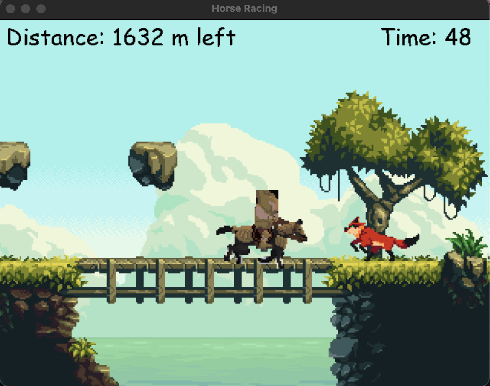

# Horse Racing Game

## Introduction
Welcome to Horse Racing, a simple Pygame-based game where you control a horse rider through a scrolling environment. In this game, you'll experience the thrill of horse racing as you navigate your way through the track.

## PyGame Tutorial

In addition, this game serves as a tutorial for learning Pygame and game development principles. This tutorial is divided into 7 lessons:
- [Lesson 1: Start Game Development with PyGame](./LESSON_1.md)
- [Lesson 2: Scroll the background](./LESSON_2.md)
- [Lesson 3: Add the Hero](./LESSON_3.md)
- [Lesson 4: Add Animations and Control](./LESSON_4.md)
- [Lesson 5: Add an Enemy](./LESSON_5.md)
- [Lesson 6: Implement Collision Detection](./LESSON_6.md)
- [Lesson 7: Display Text Components](./LESSON_7.md)

## Gameplay
- **RIGHT Arrow Key:** Increase speed and run faster.
- **LEFT Arrow Key:** Slow down the horse.
- **UP Arrow Key:** Jump to avoid coming foxes which slow you down.
- **ESC Key:** Quit the game.

## Requirements
- Python 3.12
- [Pygame](https://www.pygame.org/)

## How to Run
1. Clone this repository to your local machine and go to the project folder
2. Install Python 3.12 if you haven't already.
3. Create a Virtual Environment by running `python3 -m venv .venv`
4. Activate the Virtual Environment by running `source .venv/bin/activate`
5. Install Pygame by running `pip install pygame`.
6. Run the game by executing `python horse_racing_game.py`.

## Credits
- The game is inspired by [Horse Racing by -RemixKing-](https://scratch.mit.edu/projects/878571836/)
- The classes Spritesheet and SpriteStripAnim were sourced from [https://www.pygame.org/wiki/Spritesheet](https://www.pygame.org/wiki/Spritesheet)
- The horse rider image is from [https://admurin.itch.io/pixel-character-horse-rider](https://admurin.itch.io/pixel-character-horse-rider)
- The background image is from [https://ansimuz.itch.io/magic-cliffs-environment](https://ansimuz.itch.io/magic-cliffs-environment)
- The testing images are found from [https://lostgarden.com/2005/03/30/download-a-complete-set-of-sweet-8-bit-sinistar-clone-graphics/](https://lostgarden.com/2005/03/30/download-a-complete-set-of-sweet-8-bit-sinistar-clone-graphics/)
- The background music is from [https://ansimuz.itch.io/adventure-music-collection-pack-1](https://ansimuz.itch.io/adventure-music-collection-pack-1)

Enjoy the game! Feel free to share your feedback and suggestions.
